# 시작하기

SSACCER는 축구팀을 운영 및 관리하며 경기를 매칭하고 경기 결과를 팀원들과 소통할 수 있는 웹 서비스입니다.

## 배경

### 본 서비스는 기존 축구 플랫폼인 JOINKFA와 플랩에서 발생하는 팀원 관리의 어려움과  
### 매칭 시스템의 부재를 해결하기 위해 제작되었습니다.  
### 주요 목적은 아마추어 축구팀이 보다 손쉽게 매칭을 하고 경기 기록을 효과적으로 관리할 수 있도록 지원하는 데 있습니다.
### user에게 현실의 팀 시스템을 게임처럼 경험 할 수 있도록 UI가 형성되어 있습니다.  

## 시스템 구성
•	프론트엔드: Vue.js를 이용한 SPA(Single Page Application)
 

•	백엔드: Spring Boot와 MyBatis를 활용한 RESTful API 서버
 

•	데이터베이스: MySQL

# 사용방법

<h3> 1.접속  
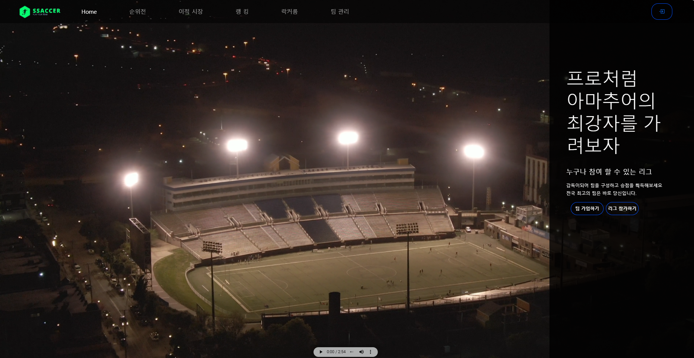

<h5> MainPage에서 팀 가입하기 리그 참가하기 및 각 nav 요소로 접근할 수 있습니다.
 
<h5> Main Page에서 로그인 후 가입 신청을 합니다.
  
<h3> 2.팀 가입   

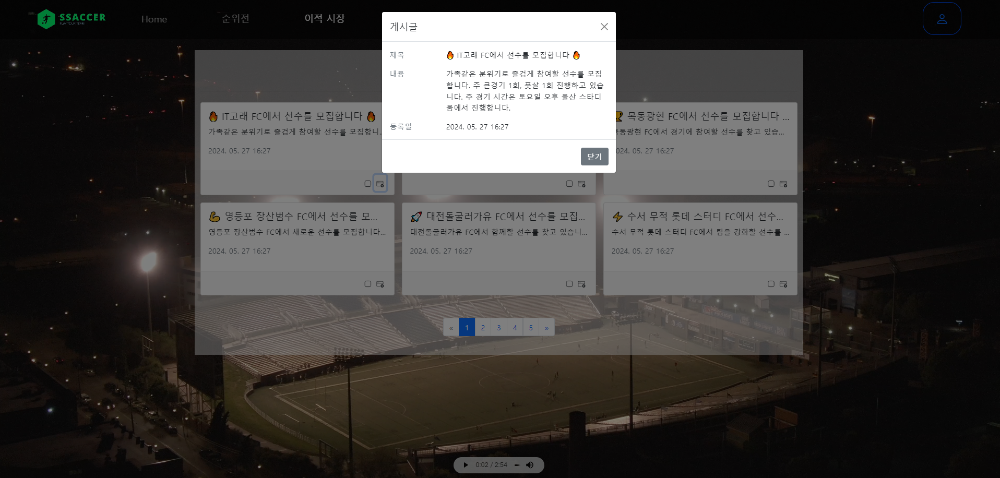
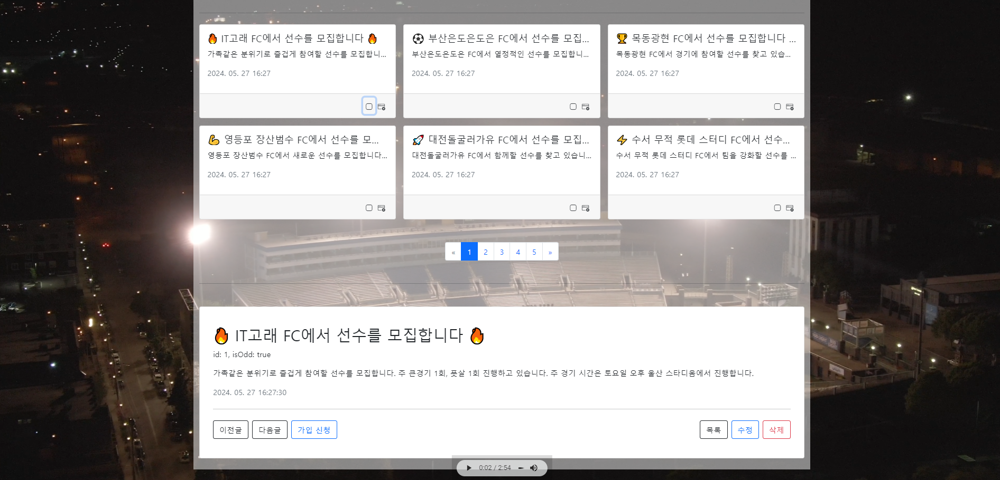
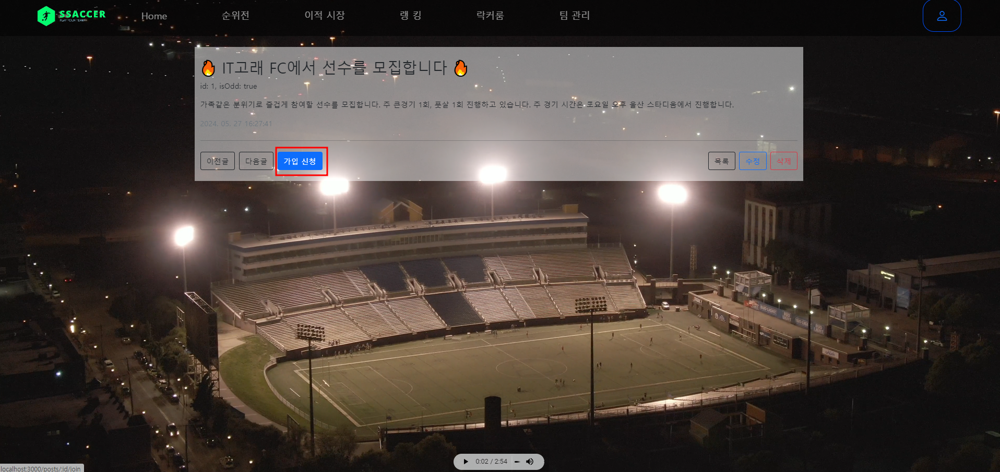
 
<h5> 팀 가입은 상단 Nav에서 이적시장으로 접근 가능합니다.
 
<h5> 팀의 지역과 설명을 확인 후에 마음에 드는 팀에 가입신청합니다. 
 
<h5> 사용자의 편의를 위해 미리보기 페이지네이션 등을 제공합니다.
  
<h3> 3.회원 관리 
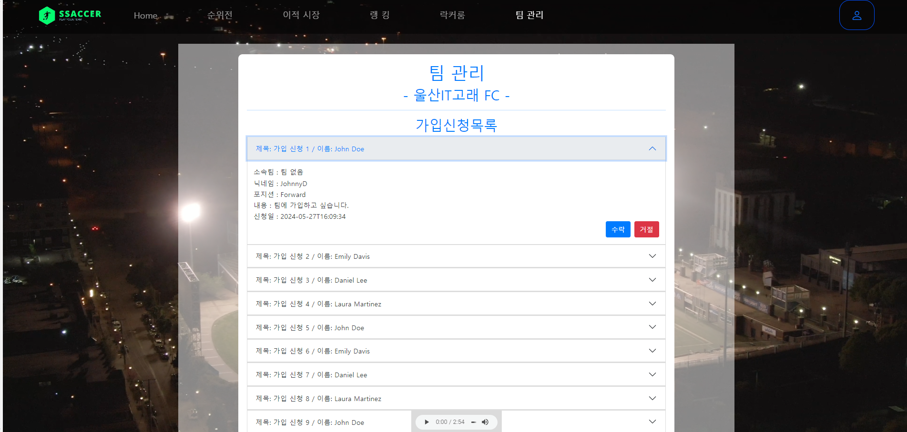
 
<h5> 신청한 회원은 신청 팀의 감독 ID의 팀관리 page에서 확인을 할 수 있습니다.
 
<h5> 신청 회원의 설명 포지션 이름을 확인하고 승인 할 수 있습니다.
  
<h3> 4.순위전  
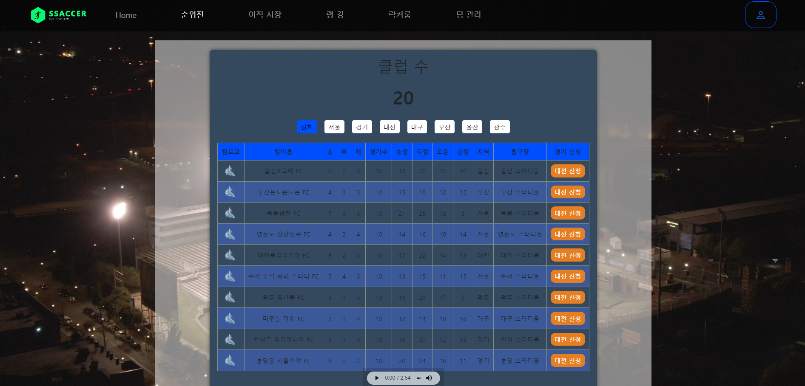
 
<h5> 각 팀의 감독은 Nav바에 순위전에서 각 지역 팀에게 대전 신청을 걸 수 있습니다.
 
<h5> 해당 page에서는 각 팀의 승, 무, 패 ,경기수 등 이전 경기의 대한 기록을 확인하고 신청할 수 있습니다.
 
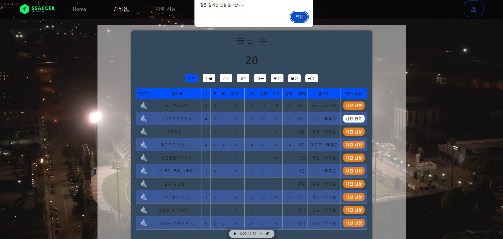
 
<h5> 복수의 팀에 신청 가능하며 본인의 팀에게 신청 시 토글을 통해 신청 불가함을 알립니다.
  
<h3> 5.순위전(2)  
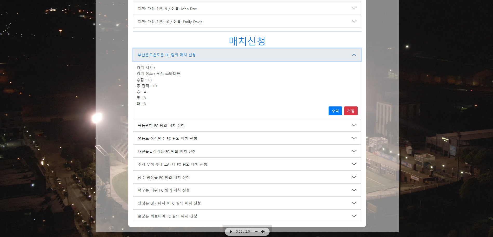
<h5> 순위전 수신 팀의 감독과 코치는 팀관리 page에서 상대편의 매치신청을 수락 할 수 있습니다.
 
<h5> 수락과 동시에 상대 팀과 자신의 팀의 스코어가 0대 0인 게시글이 라커룸에 생성됩니다. 
 
<h3> 6.라커룸  

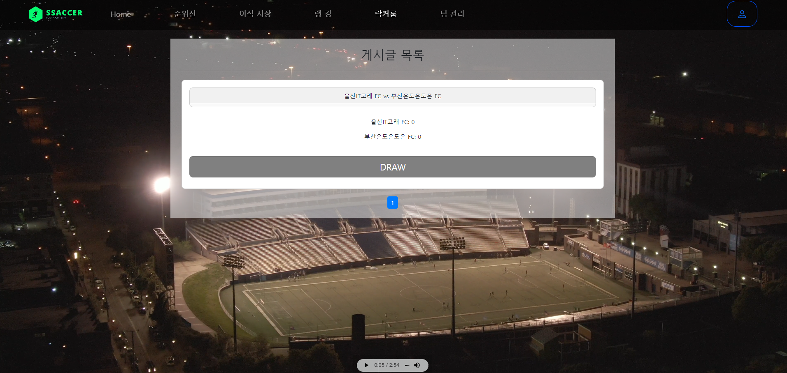

<h5> 라커룸 게시판은 경기가 생성시 create 되며 유저가 직접 생성 및 삭제가 불가능합니다. 
 
<h5> 경기 후 결과를 반영 할 수 있도록 되어있습니다. 
 
해당 게시물을 통해 간의 스쿼드, 영상을 공유하여 전술을 구성할 수 있습니다.
  
<h3> 클래스 다이어그램 
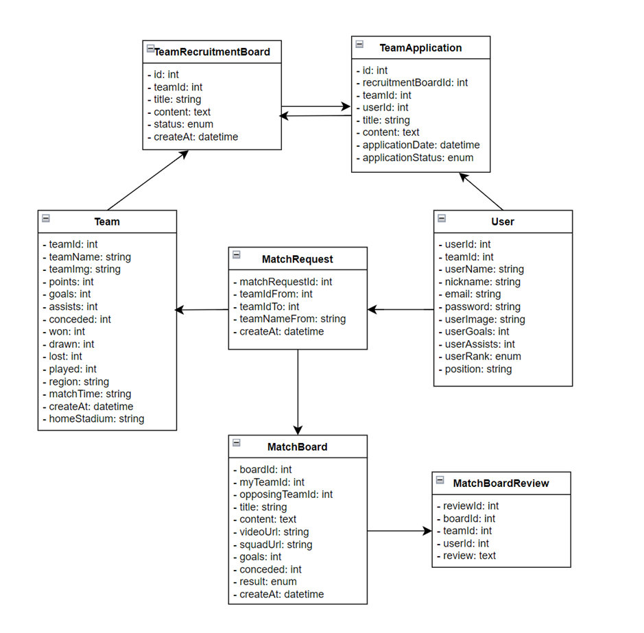
 
### 각 class의 주요한 특징 
<h5>team : 팀의 홈 구장 경기시간대의 생성을 통해 상대 팀간의 경기 시간 조율의 편의를 제공합니다.
 
<h5>User : 유저의 개인 기록을 관리하며 각 팀에서의 1(감독) 2(코치) 3(일반 회원) 등급을 통해 접근 제한을 적용합니다. 
 
<h5>MatchRequest : 각 팀의 Match 요청을 관리합니다. FROM 팀과 TO 팀의 ID를 관리하며 해당 고유 ID로 MatchBoard를 생성합니다.
 
<h5>MatchBoard : Request가 away팀에 의해 수락 되면 생성되는 board 입니다. 해당 경기의 승 무 패 득점을 기록할 수 있으며  videoUrl과 squadUrl로
경기 영상과 스쿼드 img를 등록할수 있습니다.
 
<h5>TeamRecruitmentBoard : 팀에게 지원한 개인 id를 보관하는 board 입니다. 
 
<h5>TeamApplication : 개인이 팀에게 가입신청을 한 목록을 관리하는 board 입니다.
 

## UI UX 
<h5>해당 웹은 사용자가 현실의 경기를 게임처럼 즐길 수 있도록 서비스를 제공하는 것에 의미를 두고 있습니다. 
 
<h5>사용자에게 서비스를 사용할 때 느끼는 감정과 경험을 제공하기위해 game 사운드와 개인정보page를 GameCard로 표현하여 
 
<h5>사용자 만족도를 높이고자 노력하였습니다.

  
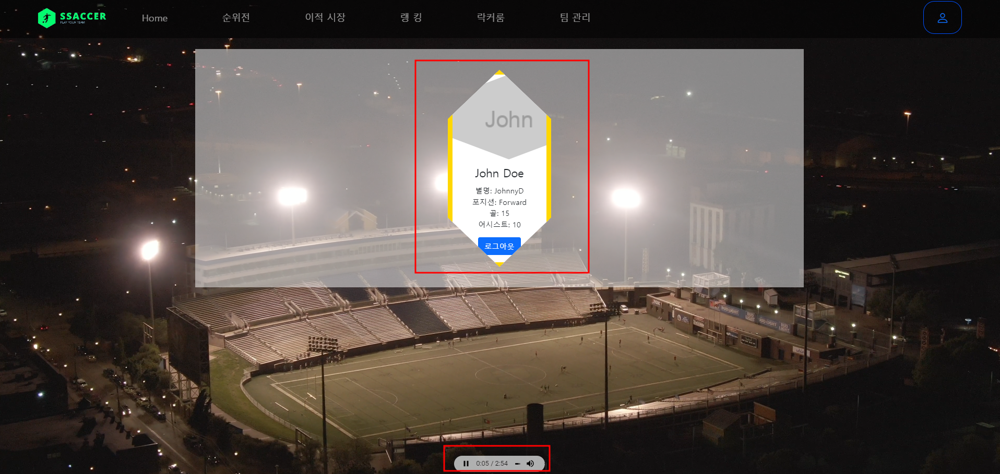

## 소감 한마디 🧠

<h3> 김유석   코드를 언제든지 수정 재사용할 수 있는 개발을 해야겠다고 생각하며 클린하게 코드를 작성하기 위해서 노력해야겠다는 생각을 했습니다.   또한 서비스를 만드는 것뿐만 아니라 잘 못된 코드를 수정하고 리팩토링하는 것도 개발자의 중요한 역량이라는 것을 경험하였습니다. 
  
<h3> 현경찬   1학기동안 배운 것들을 조합해서 흐름을 이해하고, 효율적인 분업에 대해 배울 수 있는 프로젝트였습니다!   처음이다보니 설계에 미흡했던 부분이 있었는데, 프로젝트를 하며 설꼐에 중요성을 느낄 수 있었습니다.
